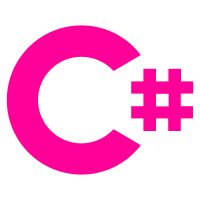

</a>

**
📢世界上最重要的不是你所站的位置，而是你前进的方向。🏃
**

    
    
### 👋 关于我 | Player

-🌏️ 天津大学软件工程专业在读生，专注于软件开发和人工智能领域的探索。
-⌨ 编程爱好者，特别热衷于 图形学 和 计算机视觉 的研究，力求通过技术解决现实问题。
-💬 联系方式：asdw1313@tju.edu.cn，乐于与志同道合的伙伴分享经验与想法。
-😋 兴趣广泛：
--📸 摄影，热爱捕捉瞬间，记录生活中的美好与细节。
--🌍 旅行，探索不同的文化与风景，拓宽视野，丰富人生经历。
--🚴‍♂️ 骑行，享受骑行带来的自由与挑战，同时也是一种放松心情的方式。
-🔄 不断进步：始终保持学习的热情，勇于迎接编程与技术的挑战，并不断扩展自己的知识领域。

### ⚒️ 技能树 | Stack

| 可能会的                                                     | 一知半解                                                     | 不懂装懂                                                     |
| ------------------------------------------------------------ | ------------------------------------------------------------ | ------------------------------------------------------------ |
| <code></code> <code></code> <code></code> <code></code> <code></code> | <code></code> <code></code> <code></code> <code></code> <code></code>| <code></code> <code></code> <code></code> |

### 🧰 工具箱 | Tool

<code></code>
<code></code>
<code></code>
<code></code>
<code></code>
<code></code>
<code></code>
<code></code>

### 🏆 数据板 | Record

